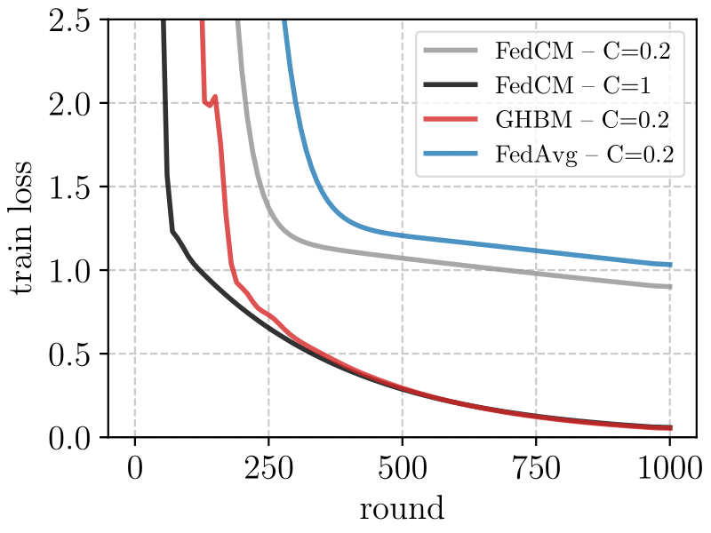
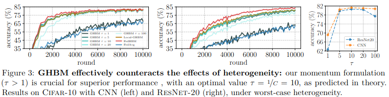
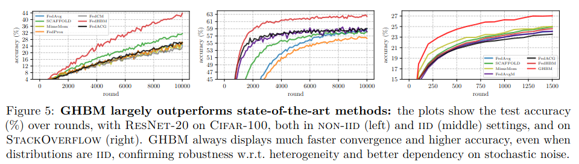
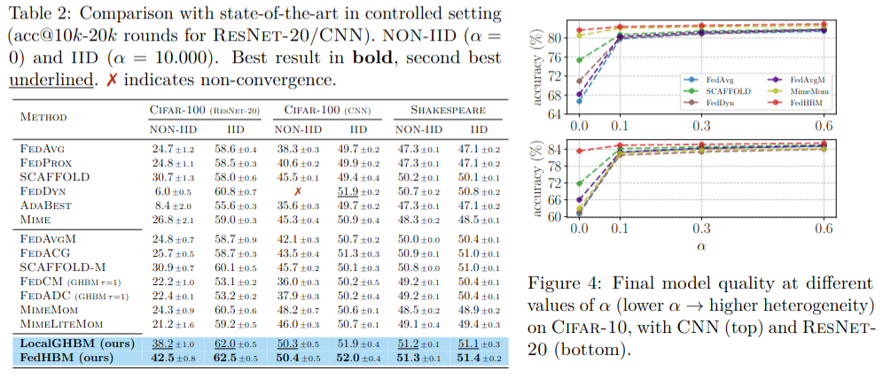
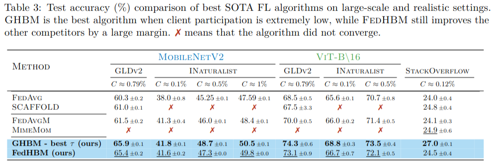
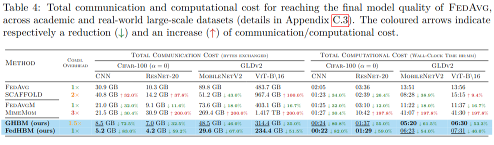

<header align='center'>
    
    <h1> 
    Communication-Efficient Federated Learning with Generalized Heavy-Ball Momentum 
    </h1>
  <p  align='center' class="tagline">
        <b>Authors</b>: Riccardo Zaccone, Sai Praneeth Karimireddy, Carlo Masone, Marco Ciccone.
  </p>
</header>

🚀 Welcome to the official repository for  _"[Communication-Efficient Federated Learning with Generalized Heavy-Ball Momentum](https://openreview.net/forum?id=LNoFjcLywb)"_.

In this work, we propose FL algorithms based on a novel _Generalized Heavy-Ball Momentum_ (**GHBM**) formulation designed to overcome the limitation of classical momentum in FL w.r.t. heterogeneous local distributions and partial participation.  

💪 **GHBM is theoretically unaffected by client heterogeneity:​** it is proven to converge in (cyclic) partial participation as other momentum-based FL algorithms do in _full participation_.  
💡 **GHBM is easy to implement:**  it is based on the key modification to make momentum effective in heterogeneous FL with partial participation. Indeed, GHBM with $\tau=1$ is equivalent to classical momentum   
🧠 **GHBM is very flexible:** in GHBM clients are _stateless_, enabling its use in cross-device scenarios, at the expense of $1.5\times$ overhead w.r.t FedAvg. In cases when the participation is not critical (e.g. $\geq10\\%$), we provide even more communication-effients variants that exploit periodic participation and local state to recover the same communication complexity as FedAvg!  
🏆 **GHBM substantially improves the state-of-art:** extensive experimentation on **large-scale settings** with high data heterogeneity and low client participation shows that **GHBM and its variants reach much better final model quality** and  **much higher convergence speed**.  
 

📄 **Read our paper on:** [[OpenReview]](https://openreview.net/forum?id=LNoFjcLywb) [[ArXiv]](https://arxiv.org/abs/2311.18578) <br>
🌍 **[Demo & Project Page](https://rickzack.github.io/GHBM)**


## Theoretical Results


In the paper we formally prove that GHBM converges under _(cyclic) partial participation_ as other momentum-based FL methods (e.g. FedCM) do in _full participation_. In particular, under the conditions of of Thm 4.11: **(i)** GHBM is not affected by statistical heterogeneity and **(ii)** has a better dependency on the stochastic noise, which scales with the entire client population, instead of the number of clients selected in a single round.  
In the paper we report a simple experiment to corroborate the theoretical findings, in which we compare the convergence of FedCM and FedAvg in (cyclic) partial participation ($C=0.2$) with GHBM, and also add FedCM in full participation ($C=1$) as a reference. As it is possible to see in the plot below, the curve of GHBM with $\tau=1/C$ as prescribed by Thm. 4.11 approaches the one of FedCM in full participation.


## Experimental Results
In section 5 of the paper, we show that: **(i)** the GHBM formulation is pivotal to enable momentum to provide an effective correction even in extreme heterogeneity, **(ii)** our adaptive LocalGHBM effectively exploits client participation to enhance communication efficiency and **(iii)** GHBM is suitable for cross-device scenarios, with stark improvement on large datasets and architectures. **All the experiments are conducted under random uniform client sampling**, as it is standard practice.


### Controlled scenario with extreme heterogeneity
We provide evidence of the effectiveness of GHBM under worst-case heterogeneity (_i.e._ $\alpha=0$) by comparing the impact of our generalized heavy-ball momentum formulation to the classical momentum approach, which corresponds to selecting $\tau>1$ in the update rule of GHBM. As shown in Figure 3, prior momentum-based methods fail to improve upon FedAvg. In contrast, as $\tau$ increases, GHBM exhibits a significant enhancement in both convergence speed and final model quality. The optimal value of $\tau$ is experimentally determined to be $\tau \approx 1/C=10$, with larger sub-optimal values only slightly affecting performance (rightmost plot).

This experiment demonstrates that, while complete heterogeneity reduction is theoretically proven only under cyclic participation (_i.e._ Thm. 4.11 holds under cyclic participation assumption), GHBM empirically achieves strong heterogeneity reduction even with random uniform client sampling. In particular, the theoretical prescription on the optimal value $\tau=1/C$ also holds in this setting.



### Comparison with the state-of-the-art | Controlled scenario
Our results in Tab. 2 underscore that methods based on classical momentum fail at improving FedAvg in scenarios with high heterogeneity and partial participation, confirming that in those cases they should not be expected to provide a significant advantage over heterogeneity.
The general ineffectiveness of classical momentum also holds for SCAFFOLD-M: as it is possible to notice, its performance is not significantly better than SCAFFOLD's, and this well aligns with the theory, where the guarantees against heterogeneity come from the use of control variates, while momentum only brings acceleration. In that our results align with previous findings in literature suggesting that variance reduction, besides theoretically strong, is often not effective empirically in deep learning.
Conversely, our algorithms outperform the FedAvg with an impressive margin of **$+20.6\\%$** and **$+14.4\\%$** on ReNet and CNN under worst-case heterogeneity, and consistently over less severe conditions (higher values of $\alpha$ in Fig. 4).






### Comparison with the state-of-the-art | Large-scale scenario
Results in Tab. 3 show a stark improvement over the state-of-art for both our algorithms, indicating that the design principle of our momentum formulation is remarkably robust and provides effective improvement even when client participation is very low (_e.g._ $C\leq 1\\%$).




### Communication and computational complexity
Results in Tab. 4 reveal that our proposed algorithms lead to a dramatic reduction in both communication and computational cost, with an average saving of  respectively **$+55.9\\%$** and **$+61.5\\%$**.
Our algorithms much show faster convergence and higher final model quality, which ultimately lead to a significant reduction of the total communication and computational cost. In particular, in settings with extremely low client participation (_e.g._ GLDv2 and INaturalist), GHBM is more suitable for best accuracy, while FedHBM is the best at lowering the communication cost.




## Implementation of other FL algorithms

This software additionally implements the code we used in the paper to simulate the following SOTA algorithms:

- [X] FedAvg - from [McMahan et al., Communication-Efficient Learning of Deep Networks from Decentralized Data](https://arxiv.org/abs/1602.05629)
- [X] FedProx - from [Li at al., Federated Optimization in Heterogeneous Networks
](https://arxiv.org/abs/1812.06127)
- [X] SCAFFOLD - from [Karimireddi et al., SCAFFOLD: Stochastic Controlled Averaging for Federated Learning](https://arxiv.org/abs/1910.06378)
- [X] FedDyn - from [Acar et al., Federated Learning Based on Dynamic Regularization](https://arxiv.org/abs/2111.04263)
- [X] AdaBest - from [Varno et al., AdaBest: Minimizing Client Drift in Federated Learning via Adaptive Bias Estimation](https://arxiv.org/abs/2204.13170)
- [x] Mime - from [Karimireddy et al., Breaking the centralized barrier for cross-device federated learning](https://openreview.net/forum?id=FMPuzXV1fR)
- [X] FedCM - from [Xu et al., FedCM: Federated Learning with Client-level Momentum](https://arxiv.org/abs/2106.10874)

## Installation

### Requirements
To install the requirements, you can use the provided requirement file and use pip in your (virtual) environment:
```shell
# after having activated your environment
$ pip install -r requirements/requirements.txt
```

## Reproducing our experiments

### Perform a single run
If you just want to run a configuration, simply run the ```train.py``` specifying the command line arguments. Please note that default arguments are specified in ```./config``` folder and all is configured such that the parameters are the ones reported in the paper. For example, to run our GHBM on CIFAR-10 with ResNet-20, just issue:
```shell
# runs GHBM on CIFAR-10 with ResNet-20, using default parameters specified in config files (K=100, C=0.1)
$ python train.py model=resnet \
                  dataset=cifar10 \
                  algo=ghbm \
                  algo.params.common.alpha=0 \
                  algo.params.center_server.args.tau=10
```
This software uses Hydra to configure experiments, for more information on how to provide command
line arguments, please refer to the [official documentation](https://hydra.cc/docs/advanced/override_grammar/basic/).

## Paper

**Communication-Efficient Federated Learning with Generalized Heavy-Ball Momentum**
_Riccardo Zaccone, Sai Praneeth Karimireddy, Carlo Masone, Marco Ciccone_ <br>
[[Paper]](https://openreview.net/forum?id=LNoFjcLywb)


## How to cite us

```
@article{zaccone2025communicationefficient,
      title={Communication-Efficient Heterogeneous Federated Learning with Generalized Heavy-Ball Momentum}, 
      author={Riccardo Zaccone and Sai Praneeth Karimireddy and Carlo Masone and Marco Ciccone},
      year={2025},
      journal={Transactions on Machine Learning Research},
      url={https://openreview.net/forum?id=LNoFjcLywb},
}
```